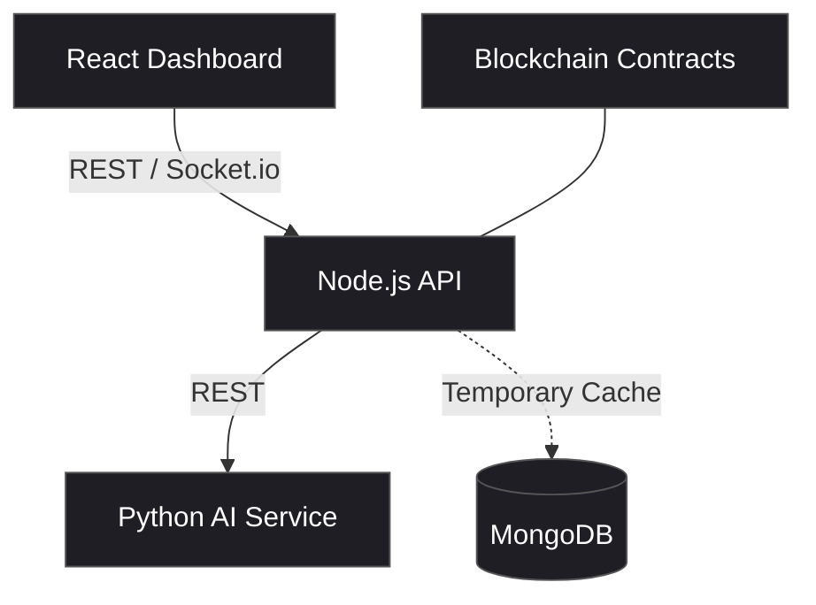

# 6G TrustGuard: Project Documentation

## 1. Executive Summary
**6G TrustGuard** is a comprehensive, full-stack trust management and anomaly detection system tailored for next-generation **6G Networks**. 
As 6G introduces extreme decentralization, ultra-dense node deployments, and heterogeneous environments, maintaining a **Zero-Trust architecture** becomes critical.

This system monitors network nodes in real-time, computes a **Fusion Trust Score** using a **Python AI Microservice**, and logs all critical trust metrics onto an **Immutable Blockchain Ledger** (Ethereum/Solidity). It simulates network attacks (e.g., DDoS, Sybil) and demonstrates how trust-based isolation can quarantine malicious nodes autonomously.

---

## 2. System Architecture

The project is structured into primary layers communicating synchronously:

### 🔬 **A. Backend (Control Layer)**
- **Runtime**: Node.js & Express.
- **WebSocket Gateway**: `Socket.io` enables true real-time synchronization, piping node states to the graph canvas every 2-3 seconds.
- **Integration**: Coordinates Python AI REST hooks and forwards anomaly events onto the Hardhat local node interface.

### 🧠 **B. AI Microservice (Python)**
- **Framework**: FastAPI (Uvicorn).
- **Core Engine**: `scikit-learn` / `TensorFlow` algorithms estimating trust weights.
- **Endpoints**:
  - **`POST /predict-attack`**: Classifies node traffic into Normal, DDoS, or Sybil.
  - **`POST /calculate-trust`**: Computes weighted **Fusion Trust Score**.

### 🌐 **C. Frontend (Visualization & Monitoring)**
- **Framework**: React 18 (built with Vite).
- **Visualizer**: **Cytoscape.js**
  - Displays nodes as lighter research-appropriate network topology grids.
  - Nodes change colors dynamically (Green = Trusted, Yellow = Suspicious, Red = Anomalous).
- **Analytics**: **Chart.js** mapped for transaction streams.

### ⛓️ **D. Blockchain (Security & Ledger)**
- **Framework**: Hardhat (Solidity `^0.8.28`).
- **Contracts**:
  1. **`NodeRegistry.sol`**: Records node profiles and communicator roles.
  2. **`TrustLedger.sol`**: 
     - Logs `fusionTrustScore` immutably on alerts triggers.
     - **Auto-Revocation Logic**: If the backend pushes a trust score below the **Anomaly Threshold** (default: 60), the contract automatically emits an `AccessRevoked` event and flags the node as blocked.

---

## 3. Core Algorithms & Logic

### 📐 **Multi-Factor Trust Fusion**
1. **Behavioral Trust (35%)**: Direct interaction quality computed from connection stats.
2. **Historical Trust (25%)**: Moving aggregate derived from the last 5 cached scores.
3. **Reputation Trust (20%)**: Neighboring node/peer feedback score averages.
4. **Context Trust (20%)**: Ambient environment default parameters.

**Fusion (Python AI)**: Processes vectors using the exact weighted algorithm inside FastAPI and updates the Blockchain ledger accordingly.

---

## 4. Key Features & Simulation

| Feature | Description |
| :--- | :--- |
| **Live Network Topology Graph** | Real-time viz of simulated wireless nodes communicating together (Cytoscape.js). |
| **Live Attack Injection** | Allows dashboard triggers for **DDoS**, **Sybil**, or **DataManipulation** to test defense thresholds. |
| **Trust Ledger Explorer** | Custom UI node showing live blocks indexing on-chain node state locks. |
| **Dynamic Role assignment** | Handles shifting authorization states (Unknown vs Authorized routers). |

---

## 5. Application in Fields

The principles designed into **6G TrustGuard** extend to several high-value sectors:

1. **6G/5G Telecommunications**: Protecting Open-RAN (Radio Access Network) infrastructures and edge computing slicing from hijacking.
2. **IoT & Smart Cities**: Managing safe routing protocols across millions of self-moving sensors (e.g., Connected Autonomous Vehicles).
3. **Decentralized Energy Grids**: Filtering fake signals in decentralized microgrid trading systems.
4. **Defense & Swarm Robotics**: Hardening communication links against spoofing in heavy interference zones.

---

## 6. Technical Stack Checklist

- **Frontend**: `React 18`, `Typescript`, `Vite`, `Cytoscape.js`, `Bootstrap`, `Chart.js`, `Axios`.
- **Backend**: `Node.js`, `Express`, `Socket.io`, `Ethers.js (v6)`.
- **AI Microservice**: `Python 3.10+`, `FastAPI`, `scikit-learn` / `TensorFlow`.
- **Blockchain**: `Solidity`, `Hardhat`, `Ethers.js` interactions.
- **Database**: `MongoDB` (enabling provisional 1H expiring visual cache logs).
